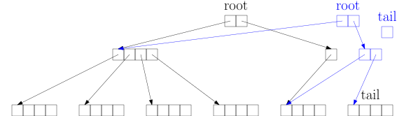
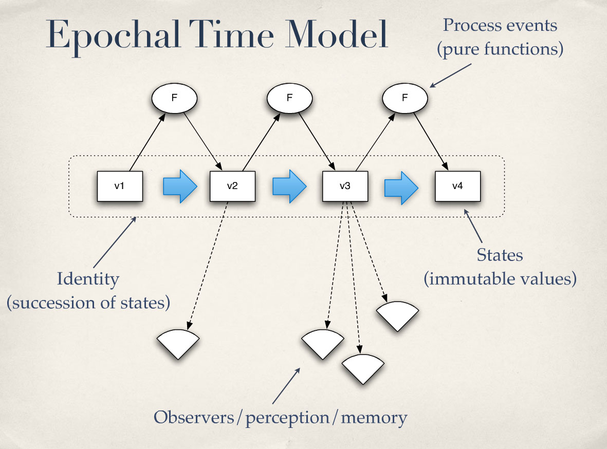
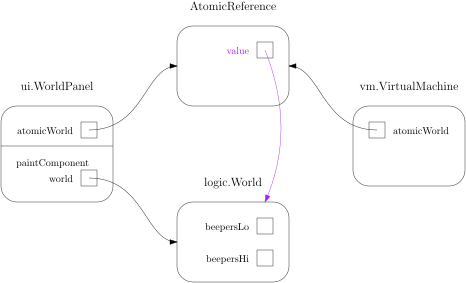

# Functional programming

> **Rich Hickey:** If you want everything to be familiar, you will never learn anything new  
> because it can't be significantly different from what you already know.

## [David Nolen – Fundamental Principles of Software](https://www.youtube.com/watch?v=1VLN57wJAcU&t=284)


> - Software project quality is dominated by:
>   - **people and process issues**
>   - *not* choice of programming language
> - Choice of programming language is primarily about:
>   - hiring/hireability
>   - developer happiness

## Ingredients

- First-class functions, i.e. functions can be:
  - stored in variables
  - passed to functions
  - returned from functions
  - anonymous expressions:
```
 lambda  x : x + 1
(lambda (x) (+ x 1))
(fn     [x] (+ x 1))
           #(+ % 1)

fun x -> x + 1
   \x -> x + 1
    x -> x + 1
    x => x + 1
         _ + 1

{ x -> x + 1 }
{     it + 1 }
{ |x|  x + 1 }
  |x|  x + 1

   [](int x)     { return x + 1; }
function (x)     { return x + 1; }
func (x int) int { return x + 1  }
```
- Expressions > Statements
  - A (somewhat) arbitrary distinction pioneered by early imperative languages
    - Statement: `if (condition) thenStatement else elseStatement`
    - Expression: `condition ? thenExpression : elseExpression`
    - Grammar bridge: `ExpressionStatement: Expression ;`
  - Functional languages traditionally have no such distinction
    - "Statements" are just expressions evaluating to `nil`
  - Modern imperative languages incorporate additional expressions into their grammar
    - Kotlin's `if` is already an expression, no grammatical need for `? :`
    - Java 14 `switch` expressions:
```java
double daysPerMonth = 0;
switch (month) {
    case JANUARY:
    case MARCH:
    case MAY:
    case JULY:
    case AUGUST:
    case OCTOBER:
    case DECEMBER:
        daysPerMonth = 31;
        break;

    case APRIL:
    case JUNE:
    case SEPTEMBER:
    case NOVEMBER:
        daysPerMonth = 30;
        break;

    case FEBRUARY:
        daysPerMonth = 28.2425;
}
```
```java
double daysPerMonth = switch (month) {
    case JANUARY, MARCH, MAY, JULY, AUGUST, OCTOBER, DECEMBER -> 31;

    case APRIL, JUNE, SEPTEMBER, NOVEMBER -> 30;

    case FEBRUARY -> 28.2425;
};
```
- Computation > Mutation
  - [The Future of JavaScript MVC Frameworks](http://swannodette.github.io/2013/12/17/the-future-of-javascript-mvcs)
  - [The Rise of Immer in React](https://www.netlify.com/blog/2018/09/12/the-rise-of-immer-in-react)
```java
jshell> String s = "hello";
s ==> "hello"

jshell> String t = s.concat(" world");
t ==> "hello world"

jshell> s
s ==> "hello"
```
```java
jshell> LocalDate a = LocalDate.of(2023, 2, 3);
a ==> 2023-02-03

jshell> LocalDate b = a.plusDays(3);
b ==> 2023-02-06

jshell> a
a ==> 2023-02-03
```

## History


### Haskell: Ivory Tower Laboratory

```haskell
-- Generics
-- Function types
-- Higher-order functions
-- Lambdas
-- Closures
-- Function composition
compose :: (b -> c) -> (a -> b) -> (a -> c)
compose f g = \x -> f (g x)

-- Type classes
countDigits :: (Num a) => a -> Int
countDigits = compose length show

-- Immutable lists & tuples
indexedPrimes :: [(Int, String)]
indexedPrimes = [(2, "The first"), (3, "The second"), (5, "The third"), (7, "The fourth")]

-- Algebraic data types
data Option a = Present a | Absent

-- Pattern matching
orElse :: Option a -> a -> a
orElse (Present x) _ = x
orElse  Absent     y = y

-- Guards
-- Recursion
find :: (a -> Bool) -> [(a, b)] -> Option b
find pred []                       = Absent
find pred ((k, v):kvs) | pred k    = Present v
                       | otherwise = find pred kvs

-- Currying
findOdd :: [(Int, b)] -> Option b
findOdd = find odd

-- Infix functions
-- Type inference
main = print (findOdd indexedPrimes `orElse` "No" ++ " prime number is odd")

-- Monads
salt :: IO ()
salt = putStrLn "Name?" >> getLine >>= \name -> putStrLn ("Hi, " ++ name ++ "!")

sugar :: IO ()
sugar = do
    putStrLn "Name?"
    name <- getLine
    let greeting = "Hi, " ++ name ++ "!"
    putStrLn greeting
```

## [Closures](https://en.wikipedia.org/wiki/Closure_(computer_programming))

> - A technique for implementing lexically scoped name binding in a language with first-class functions
> - Operationally, a closure is a record storing **a function together with an environment**

### JavaScript (1995)

```js
function add(x) {
    return function (y) {
        return x + y;
    };
}

let increment = add(1);
let three = increment(2); // 3

let powers = [1, 2, 4];
let primes = powers.map(add(1)); // [2, 3, 5]
```

- The inner function *captures* the parameter `x` of the outer function
- `x` remains available after `add` returns
- `x` is captured *by reference*, i.e. `x` is the same variable everywhere
- JavaScript allows mutation of `x` everywhere:

```js
function countFrom(x) {
    function count() {
        return x++;
    }
    if (!(x >= 0)) {
        x = 0;
    }
    return count;
}

let f = countFrom(10);
f() // 10
f() // 11
f() // 12

let g = countFrom("hi");
g() // 0
g() // 1
g() // 2
```

### C++ (2011)

```c++
auto add(int x) {
    return [x](int y) {
        return x + y;
    };
}

auto increment = add(1);
int three = increment(2); // 3

std::vector<int> powers = {1, 2, 4};
std::vector<int> primes(powers.size());
std::transform(powers.begin(), powers.end(), primes.begin(), add(1)); // [2, 3, 5]
```

- Captured variables must be explicitly mentioned in the capture list `[x]`
- By default, variables are captured *by value*:
  - Outer `x` is copied into inner `x` when lambda is evaluated
  - Outer `x` is popped off the stack when `add` returns
- Mutation of captured copies must be enabled via `mutable`:

```c++
auto countFrom(int x) {
    if (!(x >= 0)) {
        x = 0;
    }
    return [x]() mutable -> int {
        return x++;
    };
}

auto f = countFrom(10);
std::cout << f() << "\n"; // 10
std::cout << f() << "\n"; // 11
std::cout << f() << "\n"; // 12
```

### OOP 🤔 Isn't a closure just a single-method object?

```java
import java.util.function.IntUnaryOperator;

public class Add implements IntUnaryOperator {
    private final int x;

    public Add(int x) {
        this.x = x;
    }

    @Override
    public int applyAsInt(int y) {
        return x + y;
    }
}

IntUnaryOperator increment = new Add(1);
int three = increment.applyAsInt(2); // 3
```

### FP 🤔 Isn't an object just a dictionary of closures?

```js
function createAccount(balance) {

    return {deposit, withdraw, getBalance};

    function deposit(amount) {
        balance += amount;
    }

    function withdraw(amount) {
        balance -= amount;
    }

    function getBalance() {
        return balance;
    }
}

let a = createAccount(100);
a.deposit(30);
a.withdraw(7);
a.getBalance() // 123
```

# Clojure


## [Rich Hickey – A History of Clojure](https://clojure.org/about/history)

> - Most developers come to Clojure from Java, JavaScript, Python, Ruby and other OO languages
> - The most commonly anticipated problem is unfamiliar syntax, "dealing with all those parentheses"
> - But the most significant *actual* problem is learning functional programming
>   - Clojure is not multi-paradigm, it is FP or nothing
>   - None of the imperative techniques they are used to are available

## Clojure in a nutshell


[XKCD – Lisp Cycles](https://xkcd.com/297)

- Practical Lisp dialect that runs on (and embraces!) the JVM
  - Dynamically typed
  - Read-Eval-Print-Loop
  - (Dynamically) compiled
  - Code is data
- Value-oriented programming
  - Encourages pure functions
  - Discourages side effects
  - Managed mutation where needed
- Nightmare-free concurrency
  - 😱 [JLS 17.4 Memory Model](https://docs.oracle.com/javase/specs/jls/se17/html/jls-17.html#jls-17.4)
  - 😲 [Java Concurrency In Practice](https://jcip.net)
- Conservative language evolution
  - 1.1 Transients
  - 1.2 Protocols
  - 1.5 Reducers
  - 1.7 Transducers
  - 1.9 clojure.spec

## [Robert Martin – On Types](https://blog.cleancoder.com/uncle-bob/2021/06/25/OnTypes.html)

> I went from untyped languages like assembler and C, to statically typed languages like C++ and Java,
> to dynamically typed languages like Python and Ruby, and now to Clojure. [...]
> It has been 11 years now, and I feel no urge to change languages.
> I reckon that Clojure may be my last programming language.
>
> The type system in Clojure is as dynamic as Python or Ruby,
> but there is a library in Clojure called `clojure/spec` that provides all the strong typing anyone would ever need.
> However, instead of that typing being controlled by the compiler, it is controlled by *me*.
> I can enforce simple types, or very complex data relationships.
> You might think of it as a kind of pre-condition/post-condition language.
> Eiffel programmers would feel very much at home with it.
> It's an almost perfect way to engage in Design by Contract.
>
> So what do I conclude from this?
> Not much other than that static typing is not for me.
> I prefer the flexibility of dynamic typing, and the ability to enforce types if, and when, I need such enforcement.

## Data

### Primitive values

| Literal       | Type                    |
| ------------- | ----------------------- |
| `nil`         | nil                     |
| `false`       | java.lang.Boolean       |
| `42`          | java.lang.Long          |
| `3.14`        | java.lang.Double        |
| `1234567890N` | clojure.lang.BigInt     |
| `0.1M`        | java.math.BigDecimal    |
| `22/7`        | clojure.lang.Ratio      |
| `\x`          | java.lang.Character     |
| `"hello"`     | java.lang.String        |
| `#"[aeiou]"`  | java.util.regex.Pattern |
| `:north`      | clojure.lang.Keyword    |

### Compound values

| Form                                                     | Type                            |
| -------------------------------------------------------- | ------------------------------- |
| `'(1 \2 "three")`                                        | clojure.lang.PersistentList     |
| `[1 \2 "three"]`                                         | clojure.lang.PersistentVector   |
| `#{1 \2 "three"}`                                        | clojure.lang.PersistentHashSet  |
| `{:first "Rich", :last "Hickey"}`                        | clojure.lang.PersistentArrayMap |
| `{:a 1, :b 2, :c 3, :d 4, :e 5, :f 6, :g 7, :h 8, :i 9}` | clojure.lang.PersistentHashMap  |
| `(->Person "Rich" "Hickey")`                             | user.Person †                   |

† given a suitably defined `Person` record

```clojure
user=> (def fred {:name "Fred", :age 39})
#'user/fred

user=> fred
{:name "Fred", :age 39}

user=> (update "fred" :age inc)
{:name "Fred", :age 40}

user=> fred
{:name "Fred", :age 39}
```

### Vector implementation


### Structural sharing



### Code is data

| Clojure macro | Java syntax                   | Waiting period |
| ------------- | ----------------------------- | -------------: |
| `or`          | <code>x &#124;&#124; y</code> | 0 years        |
| `assert`      | `assert condition : message;` | 6 years        |
| `doseq`       | `for (E e : c) body`          | 9 years        |
| `with-open`   | `try (R r = f()) body`        | 16 years       |
| `for`         | (list comprehension)          | ?              |
| `some->`      | (safe navigation)             | ?              |

Macro libraries:
- clojure.test
- core.async
- clojure.spec
- ...


## Simplicity trumps complexity

- Complex things are intertwined, simple things are not
  - Simple is an objective measure
  - Easy is a subjective measure (familiarity/experience)
- Example: `class Child extends Parent` complects inheritance with polymorphism
  - Java 7 interfaces are simple: just polymorphism
  - C++ private inheritance is simple: just inheritance

```c++
class Point2D {
protected:
    int x;
    int y;
// ...
};

class Point3D : private Point2D {
protected:
    int z;
// ...
};

// error: cannot cast 'Point3D' to its private base class 'Point2D'
Point2D* p = new Point3D();
// Also, the 1990s called: They want their owning raw pointers back!
unique_ptr<Point2D> p = make_unique<Point3D>();
```


## Identity and state

- Objects complect identity with state (and behavior)
- That's why we have both `a==b` and `a.equals(b)`
  - Can't use `assertEquals(expectedEntity, actualEntity)` in tests
- Combinatorial explosion of collection types:

| Java | Create                         | Replace | Append  | Thread-safe |
| ---: | ------------------------------ | :-----: | :-----: | :---------: |
|  1.0 | `new Vector()`                 | O(1)    | O(1) †  | ✓           |
|  1.2 | `new ArrayList()`              | O(1)    | O(1) †  | ✗           |
|  1.2 | `Arrays.asList(2, 3, 5, 7)`    | O(1)    | ✘       | ✗           |
|  1.2 | `unmodifiableList(wrapped)`    | ✗       | ✗       |             |
|  1.2 | `synchronizedList(wrapped)`    |         |         | ✓           |
|    5 | `new CopyOnWriteArrayList()`   | O(n)    | O(n)    | ✔           |
|    5 | `Collections.emptyList()`      | ✘       | ✘       | ✔           |
|    9 | `List.of(2, 3, 5, 7)`          | ✘       | ✘       | ✔           |

† https://en.wikipedia.org/wiki/Amortized_analysis

- Clojure separates identity from (immutable) state:
  - A state is the value of an identity at a point in time
  - `=` semantics as proposed in Henry Baker's *Egal* paper



[JVM Language Summit 2009 – Are We There Yet?](https://github.com/matthiasn/talk-transcripts/blob/master/Hickey_Rich/AreWeThereYet.md)

### Karel's world as an object


### Karel's world as a value



### java.util.concurrent.AtomicReference

```java
/**
 * Atomically updates the current value with the results of
 * applying the given function, returning the updated value.
 * The function should be side-effect-free, since it may be re-applied
 * when attempted updates fail due to contention among threads.
 *
 * @param updateFunction a side-effect-free function
 * @return the updated value
 * @since 1.8
 */
public final V updateAndGet(UnaryOperator<V> updateFunction)
```

### Identities

| Reference type | Synchronicity | Coordination  |
| -------------- | ------------: | ------------- |
| `atom`         |   synchronous | uncoordinated |
| `ref`          |   synchronous | transactional |
| `agent`        |  asynchronous | uncoordinated |

- These reference types have concurrency semantics:
  - No locks in user code
  - Readers don't block writers
  - Writers don't block readers

### Atom


[JVM Language Summit 2009 – Are We There Yet?](https://github.com/matthiasn/talk-transcripts/blob/master/Hickey_Rich/AreWeThereYet.md)

```clojure
user=> (def fred (atom {:name "Fred", :age 39}))
#'user/fred

user=> fred
#object[clojure.lang.Atom 0x479a8648 {:status :ready, :val {:name "Fred", :age 39}}]

user=> @fred
{:name "Fred", :age 39}

user=> (swap! fred update :age inc)
{:name "Fred", :age 40}

user=> fred
#object[clojure.lang.Atom 0x479a8648 {:status :ready, :val {:name "Fred", :age 40}}]

user=> @fred
{:name "Fred", :age 40}
```

### Ref

```clojure
(def account (ref {:balance 100}))
(def bccount (ref {:balance 200}))

(defn transfer [source-account, target-account, amount]
  (dosync
    (alter source-account update :balance - amount)
    (alter target-account update :balance + amount)))

(transfer account bccount 50)
```

### Atom example: REST server

- Ring (webapp library)
- Compojure (routing library)

```clojure
(ns bookstore.handler
  (:require [clojure.spec.alpha :as s]
            [compojure.core :refer :all]
            [compojure.route :as route]
            [ring.middleware.json :refer [wrap-json-response wrap-json-body]]
            [ring.util.response :refer [response]]))

(s/check-asserts true)

(s/def ::title string?)
(s/def ::author string?)
(s/def ::year int?)
(s/def ::book
  (s/keys :req-un [::title ::author ::year]))

(def books
  (atom
    [{:title "Effective Java"
      :author "Joshua Bloch"
      :year 2017}
     {:title "Java Concurrency in Practice"
      :author "Brian Goetz"
      :year 2006}]))

(run! #(s/assert ::book %) @books)

(defroutes api-routes
  (GET "/" []
    (response @books))

  (GET "/:index" [index :<< Integer/parseInt]
    (response (@books index)))

  (POST "/" {book :body}
    (s/assert ::book book)
    (response (swap! books conj book)))

  (route/not-found "Not found"))

(def app
  (-> api-routes
    (wrap-json-body {:keywords? true})
    (wrap-json-response {:pretty true})))
```

## Polymorphism

### Protocols

```clojure
(defprotocol Length
  "doc string for Length protocol"
  (length [this] "doc string for length function"))

; class Human implements Length, more or less
(defrecord Human [name height]
  Length
  (length [this] height))

; But we can also provide implementations for existing types!
(extend-protocol Length
  (Class/forName "[Ljava.lang.Object;")
  (length [this] (alength this))
  
  CharSequence
  (length [this] (.length this))
  
  java.util.Collection
  (length [this] (.size this))
  
  java.util.Map
  (length [this] (.size this))
  
  Iterable
  (length [this]
    (loop [n 0
           it (.iterator this)]
      (if (.hasNext it)
        (do
          (.next it)
          (recur (inc n) it))
        n))))
```

## Testimonials

### [Java's Quirks and Wrong (?) Defaults with Brian Goetz](https://www.youtube.com/watch?v=ZyTH8uCziI4&t=2896)

What is your favorite non-Java JVM language?

> That's Clojure. Clojure is one of the few production-quality, serious JVM languages that isn't just "Let's do Java better". In some sense, Scala and Kotlin are an attempt to re-tell the Java story with a more modern twist, and that has some incremental benefits and it has some incremental costs. But fundamentally, both Scala and Kotlin have the problem that they're a lot like Java, but they aren't Java.
>
> **Clojure is not trying to be Java.** Clojure is trying to say "Let's take a well-understood programming model that has worked for 50 years that is very useful for a lot of the kinds of problems that we're still solving today, and let's integrate it nicely with the JVM and the JDK so that it is easy to consume libraries from the Java ecosystem". And I think there is a lot of leverage there. And it's definitely something that's materially different from what Java is.

### [Robert Martin – Why Clojure?](http://blog.cleancoder.com/uncle-bob/2019/08/22/WhyClojure.html)

> Over the last 5 decades, I've used a LOT of different languages. And I've come to a conclusion. My favorite language of all, **the language that I think will outlast all the others**, the language that I believe will eventually become the standard language that all programmers use is Lisp.
>
> I have not come to this conclusion casually, nor even willingly. I was not fan of Lisp. **For 40 years I was not a fan of Lisp.** And then, a decade ago I found "Structure and Interpretation of Computer Programs". And after that I found Clojure. Clojure is a Lisp that rides on top of the Java ecosystem.
>
> **I wasn't convinced right away. It took a few years.** But after the usual stumbling around and frustration, I began to realize that this language was the easiest, most elegant, least imposing language I had ever used – and not by a small margin.
>
> Look. I was not an easy sell. But my transition to Clojure was an eye-opener. Based on the lightweight syntax I expected it to be suitable for a few classroom exercises, but not for building large systems. In my mind, large systems equated to large syntax. Boy, was I wrong.
>
> What I found, instead, was that the minimal syntax of Clojure is far more conducive to building large systems, than the heavier syntax of Java or C++. In fact, it's no contest. Building large systems in Clojure is just simpler and easier than in any other language I've used.

### [James Gosling meetup with LJC 2016](https://www.youtube.com/watch?v=-ktUXFxkSkI&t=1525)

> I particularly like Clojure just because the **immutable objects** style has some really, really positive impacts. I mean, it can be really hard to write in that style, and if you try to do immutable only objects in Java – you can do it where you declare classes where every field is final – you can get some really, really cool things out of that, you know, things around **threading**...
>
> I did one where the **undo history** was based on the fact that all objects were immutable. So going back one level of undo was just like switching a pointer, and you did all mutating by rewriting. But a lot of these end up having styles that people find hard. The "everything must be immutable" style I think is great – a lot of people try it and go "Whaaaaat? I don't know how to think that way!"

Textbook implementations of Undo:
- `Stack<Command>` (OOP)
- `Stack<Memento>`
- `Stack<State>` (FP)

## Diving deeper

- https://clojure.org
- https://www.reddit.com/r/Clojure
- https://ask.clojure.org
- Programming Clojure 3rd (Alex Miller, Stuart Halloway, Aaron Bedra)
- Getting Clojure (Russ Olsen)
- Clojure, The Essential Reference (Renzo Borgatti)
