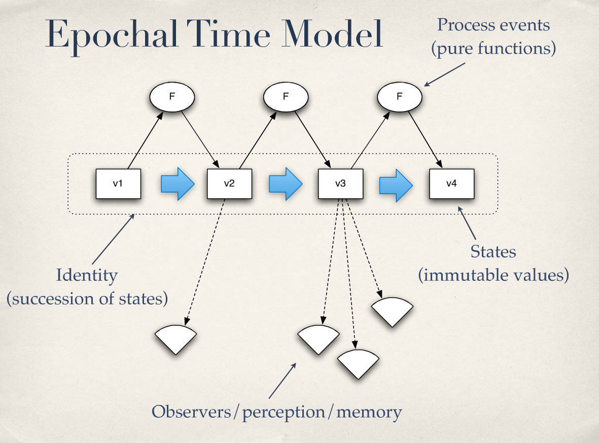
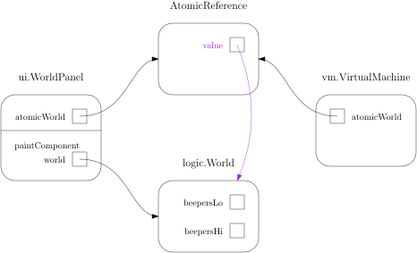
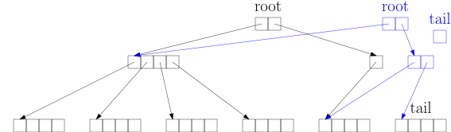
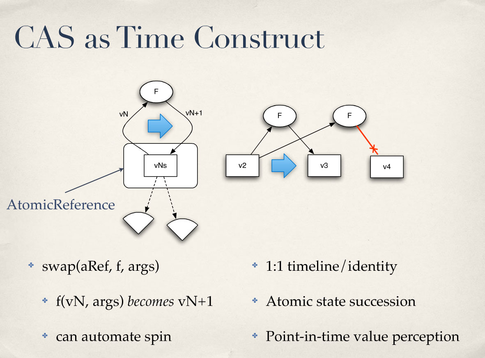

# Functional programming

> **Rich Hickey:** If you want everything to be familiar,  
> you will never learn anything new because it can't be  
> significantly different from what you already know.

## Disclaimer


> Choice of programming language is primarily about hiring/hireability and **developer happiness**.
>
> Software product quality is *not* dominated by the choice of programming language.
> It is ultimately dominated by **people and process issues**.

[David Nolen – Fundamental Principles of Software](https://www.youtube.com/watch?v=1VLN57wJAcU&t=284)

## Ingredients

- First-class functions, i.e. functions can be
  - stored in variables
  - passed to functions
  - returned from functions
  - anonymous expressions:
```
 lambda  x : x + 1
(lambda (x) (+ x 1))
(fn     [x] (+ x 1))
           #(+ % 1)

fun x -> x + 1
   \x -> x + 1
    x -> x + 1
    x => x + 1
         _ + 1

{ x -> x + 1 }
{     it + 1 }
{ |x|  x + 1 }
  |x|  x + 1

   [](int x)     { return x + 1; }
function (x)     { return x + 1; }
func (x int) int { return x + 1  }
```
- Expressions > Statements
  - [JEP 361: Switch Expressions](https://openjdk.java.net/jeps/361)
- Computation > Mutation
  - [The Future of JavaScript MVC Frameworks](http://swannodette.github.io/2013/12/17/the-future-of-javascript-mvcs)
  - [The Rise of Immer in React](https://www.netlify.com/blog/2018/09/12/the-rise-of-immer-in-react)

## History


## Haskell: Ivory Tower Laboratory

```haskell
-- Generics
-- Function types
-- Higher-order functions
-- Lambdas
-- Closures
-- Function composition
compose :: (b -> c) -> (a -> b) -> (a -> c)
compose f g = \x -> f (g x)

-- Type classes
countDigits :: (Num a) => a -> Int
countDigits = compose length show

-- Immutable lists & tuples
indexedPrimes :: [(Int, String)]
indexedPrimes = [(2, "The first"), (3, "The second"), (5, "The third"), (7, "The fourth")]

-- Algebraic data types
data Option a = Present a | Absent

-- Pattern matching
orElse :: Option a -> a -> a
orElse (Present x) _ = x
orElse  Absent     x = x

-- Guards
-- Recursion
find :: (a -> Bool) -> [(a, b)] -> Option b
find pred []                       = Absent
find pred ((k, v):kvs) | pred k    = Present v
                       | otherwise = find pred kvs

-- Currying
findOdd :: [(Int, b)] -> Option b
findOdd = find odd

-- Infix functions
-- Type inference
main = print (findOdd indexedPrimes `orElse` "No" ++ " prime number is odd")

-- Monads
salt :: IO ()
salt = putStrLn "Name?" >> getLine >>= \name -> putStrLn ("Hi, " ++ name ++ "!")

sugar :: IO ()
sugar = do
    putStrLn "Name?"
    name <- getLine
    let greeting = "Hi, " ++ name ++ "!"
    putStrLn greeting
```

## Closures

> A technique for implementing lexically scoped name binding in a language with first-class functions.
> 
> Unlike a plain function, a closure allows the function to access those *captured variables* [...],
> even when the function is invoked outside their scope.

https://en.wikipedia.org/wiki/Closure_(computer_programming)

- Are variables captured by value or by reference?
- Are mutations of captured variables allowed?

### JavaScript (1995)

```js
function add(a) {
    return function (b) {
        return a + b;
    };
}

const increment = add(1);
const three = increment(2);


function randomNumberGenerator(seed) {
    const rng = function () {
        seed = (seed * 1664525 + 1013904223) & 0xffffffff;
        return seed;
    };
    ++seed;
    return rng;
}

const rng = randomNumberGenerator(0);
const randomNumber = rng(); // 1015568748
```

### C++ (2011)

```c++
auto add(double a) {
    return [a](double b) {
        return a + b;
    };
}

const auto increment = add(1);
const auto three = increment(2);


auto randomNumberGenerator(unsigned seed) {
    const auto rng = [seed]() mutable -> unsigned {
        seed = (seed * 1664525 + 1013904223);
        return seed;
    };
    ++seed;
    return rng;
}

      auto rng = randomNumberGenerator(0);
const auto randomNumber = rng(); // 1013904223
```

### OOP 🤔 Isn't a closure just an object with a single method?

```java
public class Add implements java.util.function.IntUnaryOperator {
    private final int a;

    public Add(int a) {
        this.a = a;
    }

    @Override
    public int applyAsInt(int b) {
        return a + b;
    }
}

IntUnaryOperator increment = new Add(1);
int three = increment.applyAsInt(2);
```

### FP 🤔 Isn't an object just a dictionary of closures over shared state?

```js
function createAccount(balance) {
    return { deposit: deposit, withdraw: withdraw, getBalance: getBalance };

    function deposit(amount) {
        balance += amount;
    }

    function withdraw(amount) {
        balance -= amount;
    }

    function getBalance() {
        return balance;
    }
}
```

# Clojure

## Invention


> I would broadly characterize my work, and the work most commonly done by professional programmers, as *information systems* programming.
> Most developers are primarily engaged in making systems that acquire, extract, transform, maintain, analyze, transmit and render information — facts about the world.
> Most often, this information documents some human activity, be that of customers, suppliers, advertisers, travelers, voters, members, students, patients etc. and must deal with all the irregularity thereof.<br>
> This is in stark contrast to *artificial systems*, e.g. programming language compilers, which make up their own rules, in fully enumerated spaces, can eliminate irregularity and can reject anything which does not conform.

> By the mid 1990s, I was a C++ expert, taught advanced C++ as an adjunct at NYU, and was a proponent and advocate of the benefits of static typing [...]
> However, over time, in my experience, the suitability-to-task of these statically typed class models for information systems programming was quite low, and the benefits of the type checking minimal, especially in addressing the number one actual problem faced by programmers: the overwhelming complexity inherent in imperative, stateful programming.<br>
> As programs grew large, they required increasingly Herculean efforts to change while maintaining all of the presumptions around state and relationships, never mind dealing with race conditions as concurrency was increasingly in play.

> When I became an independent consultant in 2000, I spent more time with Common Lisp and wrote a couple of real systems in it.
> It was a revelation. Huge layers of unnecessary complexity simply vanished.
> I had the flexibility to use exactly as much language as was needed for the problem.
> The percentage of code directly related to the domain increased.
> Development was much faster, the resulting program was more general and easier to change.

[Rich Hickey – A History of Clojure](https://clojure.org/about/history)


[Stack Overflow 2019 Developer Survey](https://insights.stackoverflow.com/survey/2019#top-paying-technologies)

## Clojure in a nutshell


[XKCD – LISP Cycles](https://xkcd.com/297)

- Practical LISP dialect that runs on (and embraces!) the JVM
  - Dynamically typed
  - Read-Eval-Print-Loop
  - (Dynamically) compiled
  - Code is data
- Value-oriented programming
  - Encourages pure functions
  - Discourages side effects
  - Managed mutation where needed
- Nightmare-free concurrency
  - 😱 [JLS 17.4 Memory Model](https://docs.oracle.com/javase/specs/jls/se11/html/jls-17.html#jls-17.4)
  - 😲 [Java Concurrency In Practice](https://jcip.net)
- Conservative language evolution
  - 1.1 Transients
  - 1.2 Protocols
  - 1.5 Reducers
  - 1.7 Transducers
  - 1.9 clojure.spec

## Simplicity trumps complexity

- Complex things are intertwined, simple things are not
  - Simple is an objective measure
  - Easy is a subjective measure (familiarity/experience)
- Example: `class New extends Old` complects inheritance with polymorphism
  - Java 7 interfaces are simple: just polymorphism
  - C++ private inheritance is simple: just inheritance

```c++
class Point2D {
protected:
    int x;
    int y;
// ...
};

class Point3D : private Point2D {
protected:
    int z;
// ...
};

// error: cannot cast 'Point3D' to its private base class 'Point2D'
Point2D * p = new Point3D();
// Also, the 1990s called: They want their owning raw pointers back!
unique_ptr<Point2D> p = make_unique<Point3D>();
```


## Identity and state

- Objects complect identity with state (and behavior)
  - That's why we have both `a==b` and `a.equals(b)`
    - Can't use `assertEquals(expectedEntity, actualEntity)` in tests
  - Causes an explosion of similar but slightly different collection types:
    - `java.util.Vector`
    - `java.util.ArrayList`
    - `java.util.Arrays$ArrayList`
    - `java.util.Collections$UnmodifiableRandomAccessList`
    - `java.util.Collections$SynchronizedRandomAccessList`
    - `java.util.concurrent.CopyOnWriteArrayList`
    - `java.util.ImmutableCollections$ListN`
    - whatever `collect(toList())` returns
  - Defensive cloning
  - Concurrency nightmare
- Clojure separates identity from (immutable) state
  - A state is the value of an identity at a point in time
  - `=` semantics as proposed in the Egal Paper (Henry Baker)



[JVM Language Summit 2009 – Are We There Yet?](https://github.com/matthiasn/talk-transcripts/blob/master/Hickey_Rich/AreWeThereYet.md)

### Karel's world as an object


### Karel's world as a value



### java.util.concurrent.AtomicReference

```java
/**
 * Atomically updates the current value with the results of
 * applying the given function, returning the updated value.
 * The function should be side-effect-free, since it may be re-applied
 * when attempted updates fail due to contention among threads.
 *
 * @param updateFunction a side-effect-free function
 * @return the updated value
 * @since 1.8
 */
public final V updateAndGet(UnaryOperator<V> updateFunction)
```

## Values

### Primitive values

| expression | type |
| ---------- | ---- |
| `nil` | Null |
| `false` | java.lang.Boolean |
| `42` | java.lang.Long |
| `3.14` | java.lang.Double |
| `1234567890N` | clojure.lang.BigInt |
| `0.1M` | java.math.BigDecimal |
| `22/7` | clojure.lang.Ratio |
| `\x` | java.lang.Character |
| `"hello"` | java.lang.String |
| `#"[aeiou]"` | java.util.regex.Pattern |
| `:north` | clojure.lang.Keyword |

### Compound values

| expression | type |
| ---------- | ---- |
| `'(1 \2 "three")` | clojure.lang.PersistentList |
| `[1 \2 "three"]` | clojure.lang.PersistentVector |
| `#{1 \2 "three"}` | clojure.lang.PersistentHashSet |
| `{:first "Rich", :last "Hickey"}` | clojure.lang.PersistentArrayMap |
| `{:a 1 :b 2 :c 3 :d 4 :e 5 :f 6 :g 7 :h 8 :i 9}` | clojure.lang.PersistentHashMap |
| `(->Person "Rich" "Hickey")` | user.Person (given a suitably defined `Person` record) |

```clojure
user=> (def fred {:name "Fred", :age 39})
#'user/fred

user=> fred
{:name "Fred", :age 39}

user=> (update "fred" :age inc)
{:name "Fred", :age 40}

user=> fred
{:name "Fred", :age 39}
```

### Is everything a value?

1. String
2. Date
3. Collections
   - Singly linked list
   - Red/black tree
   - Vector
   - Hash array mapped trie
4. Database
   - think git!

### Transaction Isolation Levels & Permissible Phenomena

| Isolation level  | Dirty read | Non-repeatable read | Phantom read |
| ---------------- | :--------: | :-----------------: | :----------: |
| Read Uncommitted | 😟 | 😟 | 😟 |
| Read Committed   | 😌 | 😟 | 😟 |
| Repeatable Read  | 😌 | 😌 | 😟 |
| Serializable     | 😌 | 😌 | 😌 |

In practice, there are even more phenomena:
- dirty write
- read skew
- write skew
- lost update

Questions:
- Which transaction isolation level does your project use?
- What does that mean in practice?
- What is the rationale behind these phenomena?

### Vector implementation


### Structural sharing



## Code is data


| Clojure macro | Java syntax                   | Waiting period |
| ------------- | ----------------------------- | -------------- |
| `or`          | <code>a &#124;&#124; b</code> | 0              |
| `doseq`       | `for (E e : c)`               | 9 years        |
| `with-open`   | `try (R r = f())`             | 16 years       |
| `for`         | (for comprehension)           | ?              |
| `some->`      | (safe navigation)             | ?              |

Macro libraries:
- clojure.test
- core.async
- clojure.spec
- ...

## Polymorphism

### Protocols

```clj
(defprotocol Length
  "doc string for Length protocol"
  (length [this] "doc string for length function"))

; class Human implements Length, more or less
(defrecord Human [name height]
  Length
  (length [this] height))

; But we can also provide implementations for existing types!
(extend-protocol Length
  (Class/forName "[Ljava.lang.Object;")
  (length [this] (alength this))
  
  CharSequence
  (length [this] (.length this))
  
  java.util.Collection
  (length [this] (.size this))
  
  java.util.Map
  (length [this] (.size this))
  
  Iterable
  (length [this]
    (loop [n 0
           it (.iterator this)]
      (if (.hasNext it)
        (do
          (.next it)
          (recur (inc n) it))
        n))))
```

## Identities

| reference type | synchronicity | coordination  |
| -------------- | ------------- | ------------- |
| `atom`         |  synchronous  | uncoordinated |
| `ref`          |  synchronous  | transactional |
| `agent`        | asynchronous  | uncoordinated |

- These reference types have concurrency semantics
  - no locks in user code
  - readers don't block writers
  - writers don't block readers

### Atom



[JVM Language Summit 2009 – Are We There Yet?](https://github.com/matthiasn/talk-transcripts/blob/master/Hickey_Rich/AreWeThereYet.md)

```clojure
user=> (def fred (atom {:name "Fred", :age 39}))
#'user/fred

user=> fred
#object[clojure.lang.Atom 0x479a8648 {:status :ready, :val {:name "Fred", :age 39}}]

user=> @fred
{:name "Fred", :age 39}

user=> (swap! fred update :age inc)
{:name "Fred", :age 40}

user=> fred
#object[clojure.lang.Atom 0x479a8648 {:status :ready, :val {:name "Fred", :age 40}}]

user=> @fred
{:name "Fred", :age 40}
```

### Ref

```clojure
(def account (ref {:balance 100}))
(def bccount (ref {:balance 200}))

(defn transfer [source-account, target-account, amount]
  (dosync
    (alter source-account update :balance - amount)
    (alter target-account update :balance + amount)))

(transfer account bccount 50)
```

## Backend example: REST Server

- Ring (webapp library)
- Compojure (routing library)

```clojure
(ns bookstore.handler
  (:require [clojure.spec.alpha :as s]
            [compojure.core :refer :all]
            [compojure.route :as route]
            [ring.middleware.json :refer [wrap-json-response wrap-json-body]]
            [ring.util.response :refer [response]]))

(s/check-asserts true)

(s/def ::title string?)
(s/def ::author string?)
(s/def ::year int?)
(s/def ::book
  (s/keys :req-un [::title ::author ::year]))

(def books
  (atom
    [{:title "Effective Java"
      :author "Joshua Bloch"
      :year 2017}
     {:title "Java Concurrency in Practice"
      :author "Brian Goetz"
      :year 2006}]))

(run! #(s/assert ::book %) @books)

(defroutes api-routes
  (GET "/" []
    (response @books))

  (GET "/:index" [index :<< Integer/parseInt]
    (response (@books index)))

  (POST "/" {book :body}
    (s/assert ::book book)
    (response (swap! books conj book)))

  (route/not-found "Not found"))

(def app
  (-> api-routes
    (wrap-json-body {:keywords? true})
    (wrap-json-response {:pretty true})))
```

## Testimonials

### Brian Goetz (Java language architect)

What is your favorite non-Java JVM language?

> That's Clojure. Clojure is one of the few production-quality, serious JVM languages that isn't just "Let's do Java better". In some sense, Scala and Kotlin are an attempt to re-tell the Java story with a more modern twist, and that has some incremental benefits and it has some incremental costs. But fundamentally, both Scala and Kotlin have the problem that they're a lot like Java, but they aren't Java.
>
> **Clojure is not trying to be Java.** Clojure is trying to say "Let's take a well-understood programming model that has worked for 50 years that is very useful for a lot of the kinds of problems that we're still solving today, and let's integrate it nicely with the JVM and the JDK so that it is easy to consume libraries from the Java ecosystem". And I think there is a lot of leverage there. And it's definitely something that's materially different from what Java is.

[Java's Quirks and Wrong (?) Defaults with Brian Goetz](https://www.youtube.com/watch?v=ZyTH8uCziI4&t=2896)

### Robert Martin (SOLID, Clean Code)

> Over the last 5 decades, I've used a LOT of different languages. And I've come to a conclusion. My favorite language of all, **the language that I think will outlast all the others**, the language that I believe will eventually become the standard language that all programmers use is Lisp.
>
> I have not come to this conclusion casually, nor even willingly. I was not fan of Lisp. **For 40 years I was not a fan of Lisp.** And then, a decade ago I found "Structure and Interpretation of Computer Programs". And after that I found Clojure. Clojure is a Lisp that rides on top of the Java ecosystem.
>
> **I wasn't convinced right away. It took a few years.** But after the usual stumbling around and frustration, I began to realize that this language was the easiest, most elegant, least imposing language I had ever used – and not by a small margin.
>
> Look. I was not an easy sell. But my transition to Clojure was an eye-opener. Based on the lightweight syntax I expected it to be suitable for a few classroom exercises, but not for building large systems. In my mind, large systems equated to large syntax. Boy, was I wrong.
>
> What I found, instead, was that the minimal syntax of Clojure is far more conducive to building large systems, than the heavier syntax of Java or C++. In fact, it's no contest. Building large systems in Clojure is just simpler and easier than in any other language I've used.

[The Clean Code Blog – Why Clojure?](http://blog.cleancoder.com/uncle-bob/2019/08/22/WhyClojure.html)

### James Gosling (Father of Java)

> I particularly like Clojure just because the **immutable objects** style has some really, really positive impacts. I mean, it can be really hard to write in that style, and if you try to do immutable only objects in Java – you can do it where you declare classes where every field is final – you can get some really, really cool things out of that, you know, things around **threading**...
>
> I did one where the **undo history** was based on the fact that all objects were immutable. So going back one level of undo was just like switching a pointer, and you did all mutating by rewriting. But a lot of these end up having styles that people find hard. The "everything must be immutable" style I think is great – a lot of people try it and go "Whaaaaat? I don't know how to think that way!"

[James Gosling meetup with LJC 2016](https://www.youtube.com/watch?v=-ktUXFxkSkI&t=1525)

Textbook implementations of Undo:
- `Stack<Command>` (OOP)
- `Stack<Memento>`
- `Stack<State>` (FP)

## Diving deeper

- https://clojure.org
- https://www.reddit.com/r/Clojure
- https://ask.clojure.org
- Programming Clojure 3rd (Alex Miller, Stuart Halloway, Aaron Bedra)
- Getting Clojure (Russ Olsen)
- Clojure, The Essential Reference (Renzo Borgatti)

## Retrospective

> Most developers come to Clojure from Java, JavaScript, Python, Ruby and other OO languages.
> The most commonly anticipated problem is unfamiliar syntax, "dealing with all those parentheses",
> but the most significant actual problem is learning functional programming.
> Clojure is not multi-paradigm, it is FP or nothing.
> None of the imperative techniques they are used to are available.

> While there is a learning curve, users experience benefits all along the way.
> They find the amount of code they have to write is significantly reduced, 2–5x or more.
> A much higher percentage of the code they are writing is related to their problem domain.
> Their defect rates are reduced.
> And they gradually come to realize how much of their mental energy previously had been consumed by trying to manage state.

[Rich Hickey – A History of Clojure](https://clojure.org/about/history)
